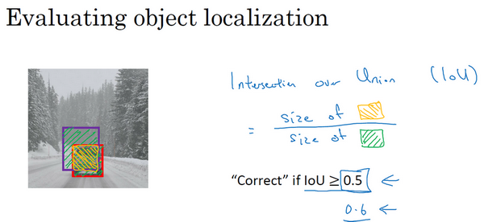

## CNN

滑动窗口不能精确获得目标物体的bouding box(边界框)，可能会产生偏移。

### yolo

yolo算法能精确获得bounding box位置，基本思想：将图像分割成nxn个方格，对每个方格采用图像分类和定位算法。

每个方格都要输出一个向量 y = [Pc bx by bh bw c1 c2 c3]，Pc代表是否存在目标物体，bx by是中心点 x，y占小方格的比例（<1），后面三个代表三种分类。bh，bw是高宽占据整张图片的比例（为什么是整张图而不是每个方格呢，这是因为有的物体可能会大于方格，这样会造成bh、bw>1，不能归一化）。

最终会输出一个nxnx8的数据。 

确定输出大小之后，我们可以选择卷积层和池化层来让最终输出数据为nxnx8。最终进行训练获得一个好的参数。

> n越大，把原图分割的每个部分就越小，两个对象的中点在同一个方格的概率会越小。

#### 交并比 (intersection over union )

交并比可以用来评估对象检测算法的精准程度，交并比（**loU**）函数做的是计算两个边界框交集和并集之比。如图紫色框红色框分别是预测器和实际边界框。

评判标准：如果iou>=0.5代表结果可以接受，iou越接近1，效果越好。

#### 非极大抑制 （Non–max suppression）
算法可能对同一个对象做出多次检测，所以算法不是对某个对象检测出一次，而是检测出多次。非极大值抑制这个方法可以确保你的算法对每个对象只检测一次，本质上是对结果进行过滤。
举个例子：

1. 找到所有pc中最大的矩形
2. 再找出和这个矩形iou较大的，过滤掉。（代表他们检测的是同一对象）
3. 从剩余的矩形中找到pc最大的，进行上述操作，直到没有剩余矩形。

#### anchor box

***为什么提出anchor box？***

主要有两个原因：

- 一个窗口只能检测一个目标
- 无法解决多尺度问题。

举个例子：

如果有两个物体的中心点在同一个方格里，那么只能输出一个类别，因为y是1x8的。所以要想识别两个物体，y的维度首先就要x2，改为1x16，也就是y = [pc bx by bw bh c1 c2 c3 pc bx by bw bh c1 c2 c3]。

